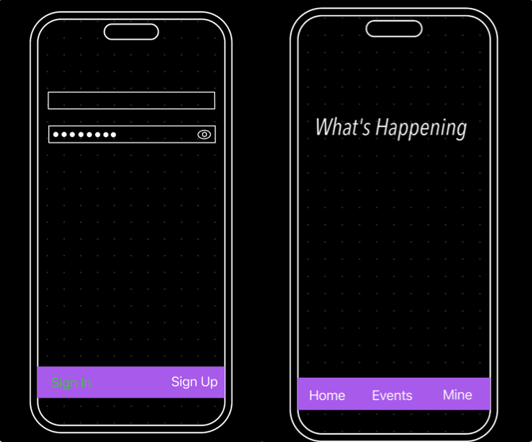
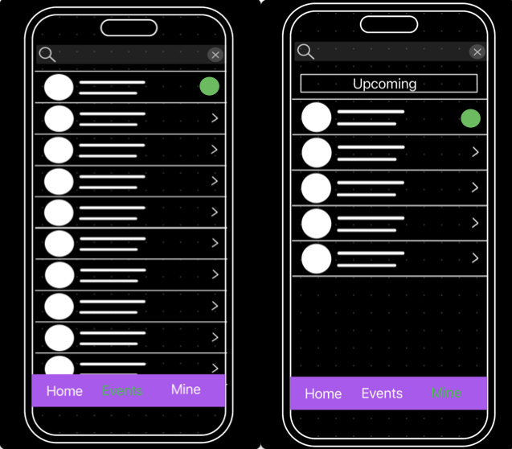
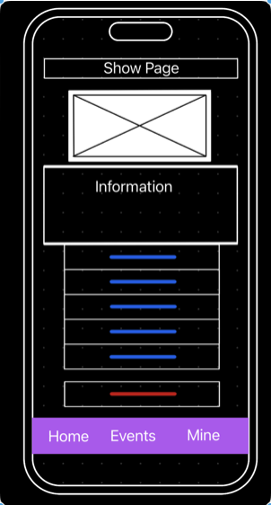
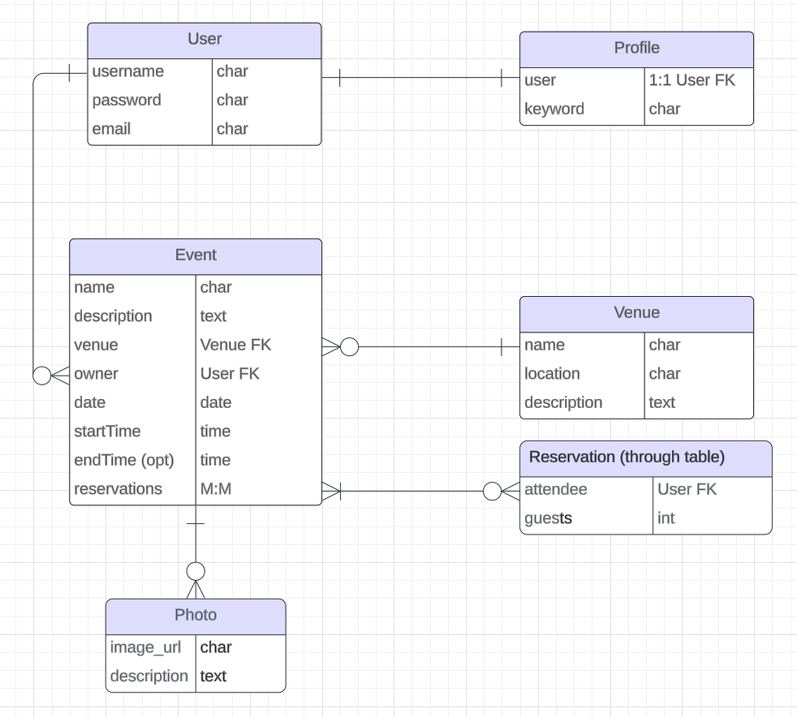

# What's Happening

An event planner for everyone!  
 - Event planners can organize events for a  predefined list of venues, invite attendees to your event.
 - Event goers can search for events they want to go to and save the ones they want to attend.

## User Stories

  - As a user, I want to sign up.
  - As a user, I want to log in. 
  - As a user, I want to sign out. 
  - As a user, I want to create my own event.
  - As an event owner, I want to assign a venue to an event.
  - As an event owner, I want to edit my event. 
  - As an event owner, I want to cancel (delete) my event. 
  - As an event owner, I want to upload photos to showcase my event.
  - As a user, I want to view upcoming events.
  - As a user, I want to make a reservation for an event for their upcoming events.
  - As a user, I want to search for events by date.
  - As a user, I want to search for events by venue.
  - As a user, I want to search for events by name.

## Wireframes

## ERD

## Technologies Used

  - Python
  - Django
    

## Icebox / Next Steps

  - As a user, I want the ability to change my password.
  - As a user, I want the ability to view past events.
  - As a user, I want the ability to add a venue.
  - As a user, I want to create my own recurring event.
  - As an event owner, I want to create new recurrences of my event.
  - As an event owner, I want to invite other people to my event.