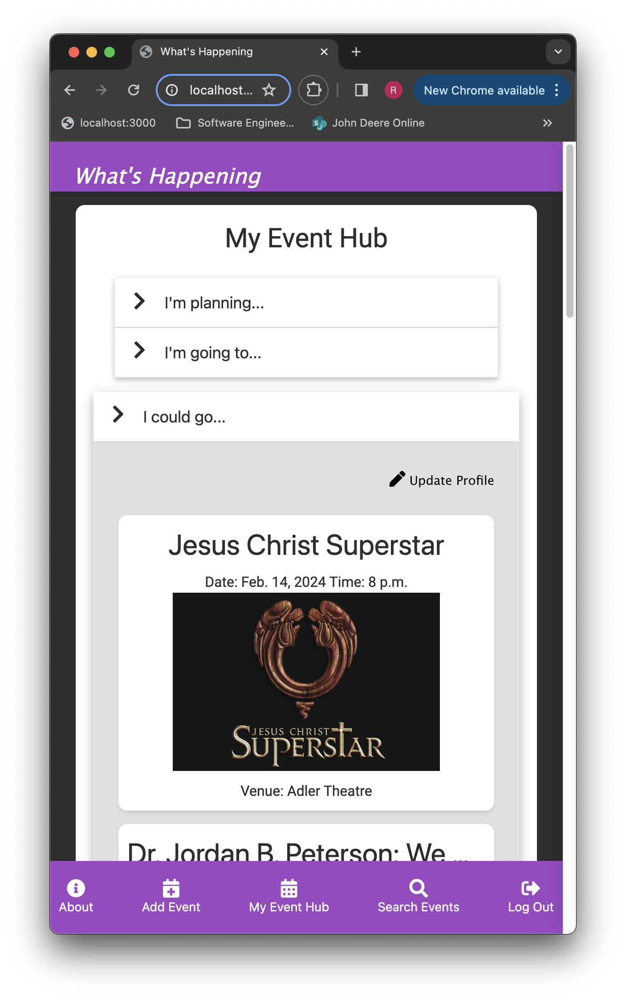
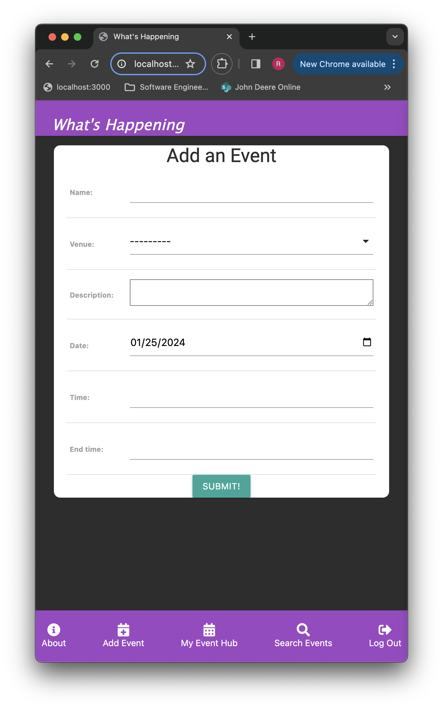
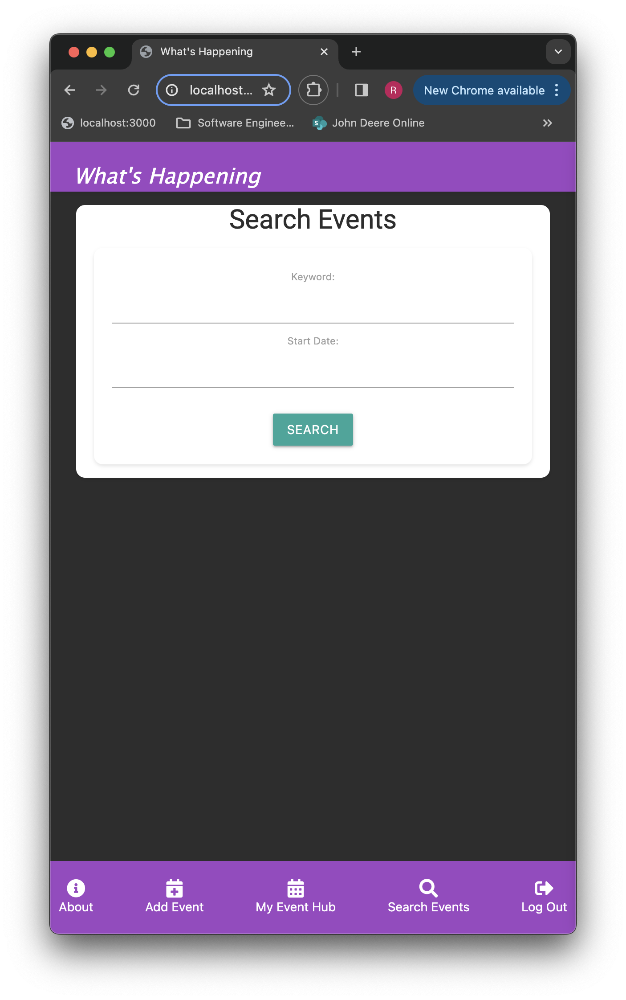
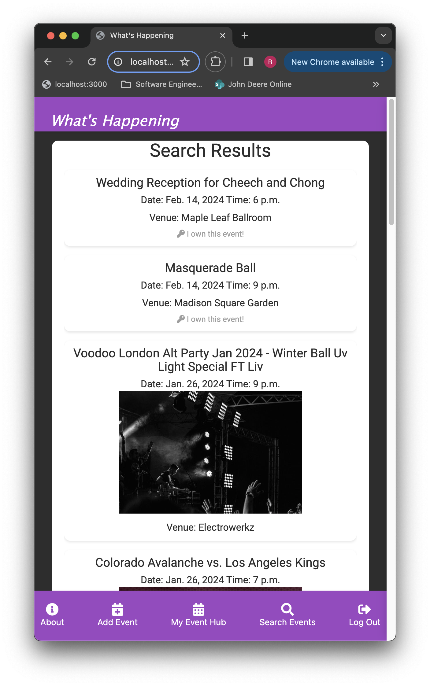
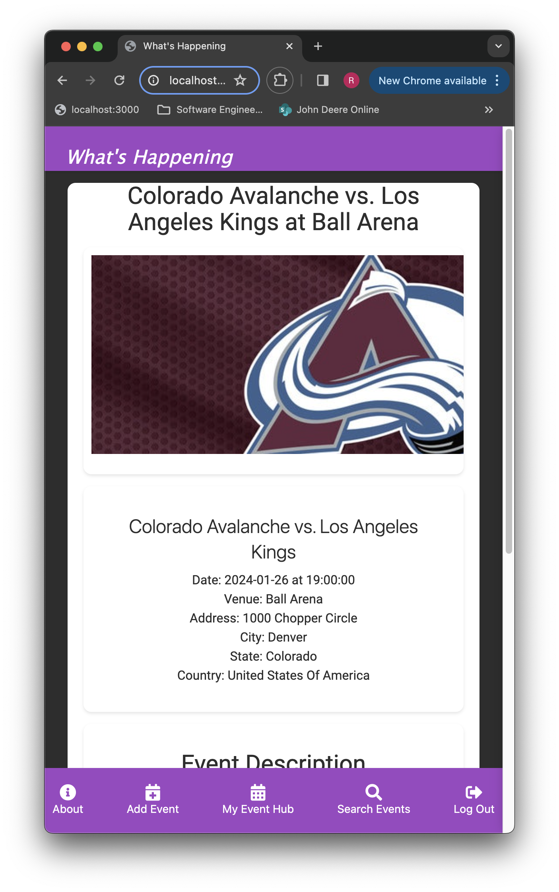
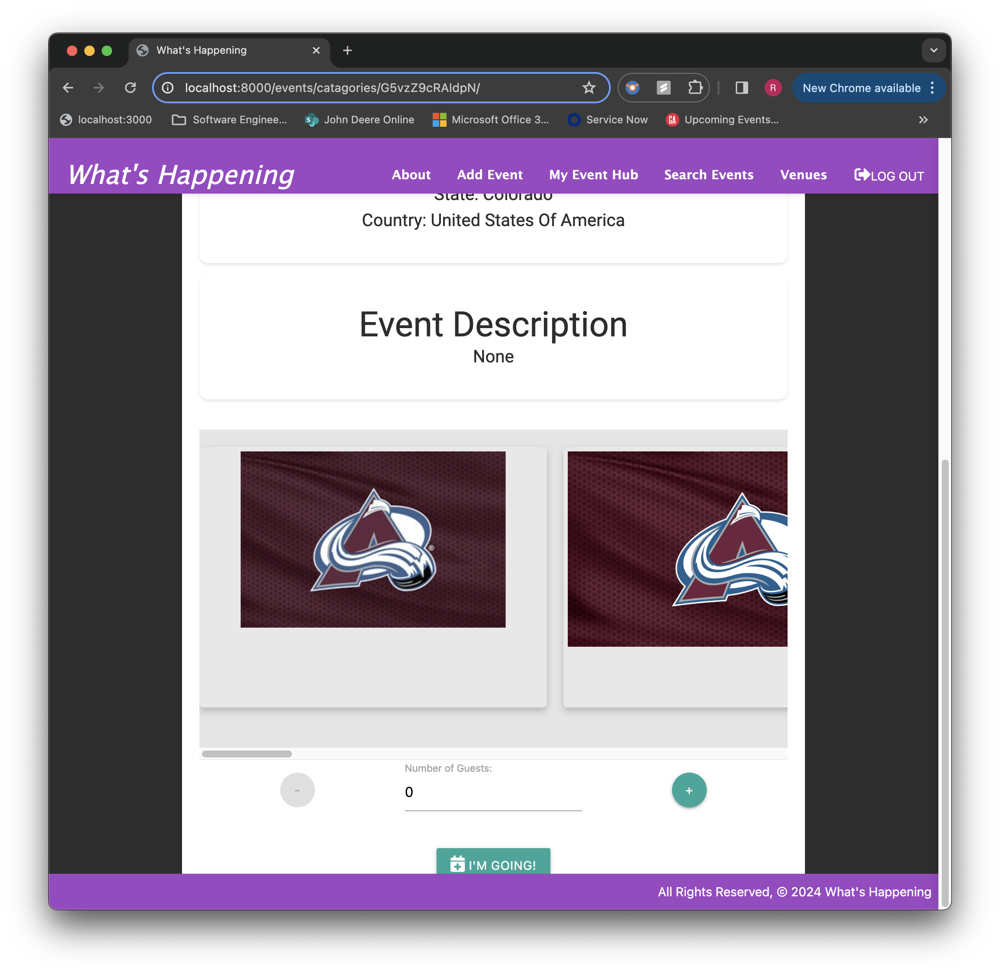
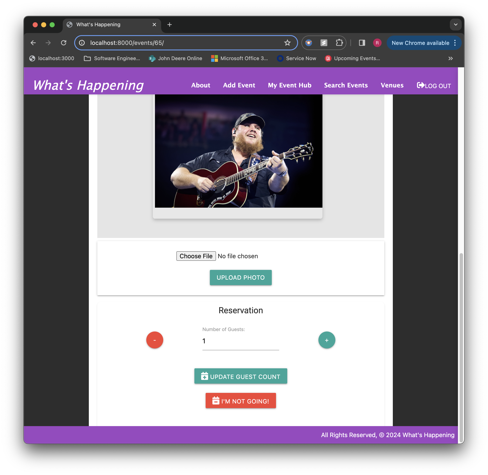
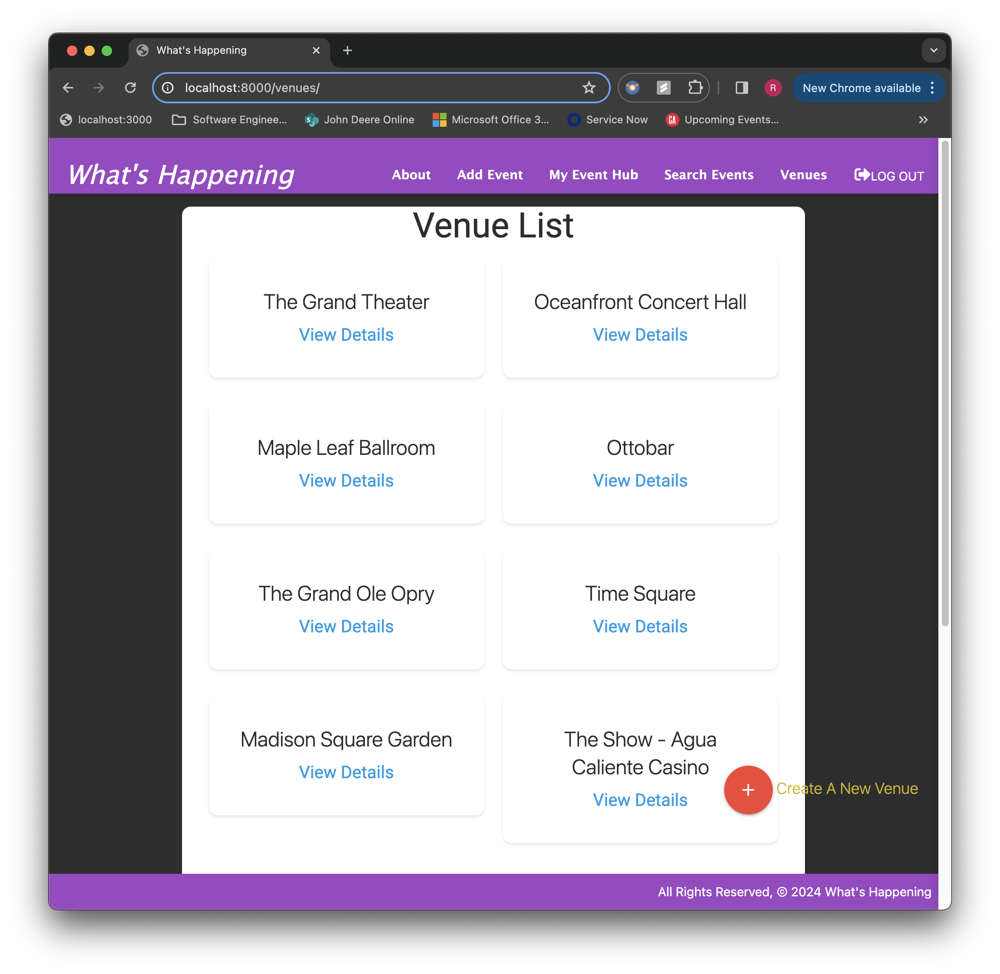

# What's Happening

An event planner for everyone!  
 - Event planners can organize events for a  predefined list of venues, invite attendees to your event.
 - Event goers can search for events they want to go to and "reserve" the ones they want to attend.  

Event search not only searches all the events created within What's Happening, it also searches Ticketmaster using the Ticketmaster Discovery API v2

## Getting Started

https://whats-happening.onrender.com/

## User Stories

  - As a user, I want to sign up.
  - As a user, I want to log in. 
  - As a user, I want to sign out. 
  - As a user, I want to create my own event.
  - As an event owner, I want to assign a venue to an event.
  - As an event owner, I want to edit my event. 
  - As an event owner, I want to cancel (delete) my event. 
  - As an event owner, I want to upload photos to showcase my event.
  - As a user, I want to create a new venue.
  - As a user, I want to update a venue.
  - As a user, I want to delete a venue.
  - As a user, I want to view upcoming events.
  - As a user, I want to make a reservation for an event.
  - As a user, I want to cancel a reservation for an event.
  - As a user, I want to change the number of guests I'm bringing to an event.
  - As a user, I want to search for events by date.
  - As a user, I want to search for events by keyword (which searches name, description, and venue).
  - As a user, I want to add a venue.
  - As a user, I want to search Ticketmaster events by date.
  - As a user, I want to search Ticketmaster events by keyword.
  - As a user, I want to see a hub of my events so I have a one-stop shop for all my planned, rsvp'ed, and possible events.
  - As a user, I want to set a default keyword in my profile so that I can automatically see its search results in my hub.
  - As a user, I want the application to look good whether I'm on my laptop or my phone.

## Screenshots

<!-- 

 -->

My Event Hub shows you:
1. Events you are planning (with a link to create a new event)
2. All the events you have an upcoming reservation for
3. Search results of events you may be interested in based on your personal profile

Create an event:

Search for events by keword and/or date with search results showing both events created within What's Happening plus other events found in Ticketmaster API:

See the details for an event, upload photos to it, and make/change/cancel a "reservation" for that event:

Manage Venues within What's Happening:

## ERD

## Technologies Used

  - Python
  - Django
  - PostgreSQL
  - CSS --> Materialize
  - API --> Ticketmaster Discovery v2
  - AWS --> S3 Bucket
    

## Icebox / Next Steps

  - As a user, I want the ability to change my password.
  - As a user, I want to create my own recurring event.
  - As an event owner, I want to create new recurrences of my event.
  - As an event owner, I want to invite other people to my event.
  - As a user, I want to hide results from api search that have already been added to What's Happening.
  - As a user, I want the ability to view past events that I've created.
  - As a user, I want the ability to view past events that I had a reservation for.
  - As a user, I want to see a YouTube video associated with the event so I can get a taste of it before deciding if I want to attend.
  
